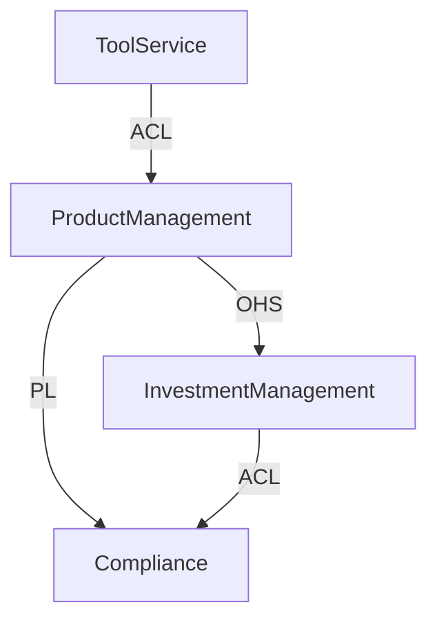

# 领域建模自动化引擎（Domain Modeling Engine）

## 一、核心定位

该技能用于：

> 自动识别、构建和演化领域模型，消费 `extract-business-entity` 生成的Domain数据，输出完整的领域架构。

### 与 extract-business-entity 的关系

```
┌─────────────────────────┐      ┌─────────────────────────┐
│  extract-business-entity │ ───► │  domain-modeling-engine │
│    (实体提取与合并)       │      │    (模型构建与演化)       │
├─────────────────────────┤      ├─────────────────────────┤
│ - 提取业务实体            │      │ - 聚合推断               │
│ - 增量合并               │      │ - 关系语义分析            │
│ - 版本管理               │      │ - 不变式建模             │
│ - 冲突标记               │      │ - 限界上下文识别          │
│ - 来源追溯               │      │ - 模型版本对比            │
└─────────────────────────┘      └─────────────────────────┘
         │                                 │
         ▼                                 ▼
   data/domains/{domain}/           output/domain-models/
   ├── entities/                     ├── {domain}-model.json
   ├── versions/                     ├── {domain}-diagram.mmd
   └── merges/                       └── {domain}-report.md
```

**工作流**:
1. `extract-business-entity` 负责从各种材料中提取实体并维护Domain版本
2. `domain-modeling-engine` 读取Domain数据，进行高级建模分析
3. 两者协同实现完整的增量式领域建模

---

## 二、输入规范

### 输入来源

引擎从以下位置读取Domain数据：

```
skills/extract-business-entity/data/domains/{domain-name}/
├── domain.json              # Domain元数据
├── entities/                # 实体定义
│   ├── {EntityName}.json
│   └── ...
└── versions/                # 版本历史
    └── {version}.json
```

### 实体数据格式

```json
{
  "name": "MutualFund",
  "domain": "mutual-fund",
  "version": "1.2.0",
  "description": "共同基金产品",
  "attributes": [...],
  "relationships": [...],
  "businessRules": [...],
  "sources": ["doc-a", "code-b"],
  "createdAt": "...",
  "updatedAt": "..."
}
```

---

## 三、核心能力

### 1️⃣ 聚合推断 (Aggregate Inference)

通过分析实体间关系，推断聚合边界：

```
分析维度:
├─ 外键方向 (谁持有引用)
├─ 修改频率 (同时变更的频率)
├─ 不变式作用范围 (规则跨越哪些实体)
├─ 生命周期依赖 (创建/删除依赖)
└─ 事务边界 (业务操作的原子性)

输出:
├─ 聚合根识别
├─ 聚合边界划分
└─ 跨聚合引用标记
```

### 2️⃣ 关系语义分析 (Relationship Semantic Analysis)

不仅识别结构关系，还识别语义：

| 结构关系 | 语义关系 | 说明 |
|---------|---------|------|
| 1:1 | ownership | 拥有关系 |
| 1:N | composition | 组合关系 |
| N:1 | reference | 引用关系 |
| M:N | association | 关联关系 |

### 3️⃣ 不变式建模 (Invariant Modeling)

将业务规则建模为领域不变式：

```
输入: businessRules[]
输出:
├─ Entity Invariants (实体级别不变式)
│   └─ 如: MutualFund.fees must not be empty
├─ Aggregate Invariants (聚合级别不变式)
│   └─ 如: Investment.totalAmount = sum(Transaction.amount)
└─ Cross-Aggregate Constraints (跨聚合约束)
    └─ 如: Investor.totalInvestment ≤ Investor.riskLimit
```

### 4️⃣ 限界上下文识别 (Bounded Context Identification)

基于实体聚类和关系分析，识别限界上下文：

```
分析信号:
├─ 高频内部交互，低频外部交互
├─ 统一业务术语
├─ 独立生命周期
└─ 独立部署边界

输出:
├─ BoundedContext定义
├─ 上下文映射 (Context Map)
└─ 集成模式建议 (ACL, OHS, etc.)
```

### 5️⃣ 模型版本对比 (Model Version Diff)

对比两个版本的领域模型：

```
对比维度:
├─ 实体增删改
├─ 属性变化
├─ 关系变化
├─ 聚合边界变化
├─ 不变式变化
└─ 限界上下文变化

输出:
├─ 变更摘要
├─ 影响分析
└─ 迁移建议
```

---

## 四、输出规范

### 输出结构

```
skills/domain-modeling-engine/output/
└── {domain-name}/
    ├── model.json              # 完整领域模型 (JSON DSL)
    ├── diagram.mmd             # Mermaid ER图
    ├── context-map.mmd         # 限界上下文图
    ├── report.md               # 建模报告
    └── versions/               # 历史模型版本
        └── {version}/
            ├── model.json
            ├── diagram.mmd
            └── report.md
```

### 模型JSON格式

```json
{
  "domain": {
    "name": "mutual-fund",
    "version": "1.2.0",
    "description": "共同基金投资领域",
    "generatedAt": "2024-01-20T15:00:00Z"
  },
  "entities": [
    {
      "name": "MutualFund",
      "type": "AggregateRoot",
      "attributes": [...],
      "invariants": [...]
    }
  ],
  "aggregates": [
    {
      "name": "FundAggregate",
      "root": "MutualFund",
      "entities": ["MutualFund", "Fee", "Prospectus"],
      "invariants": [...]
    }
  ],
  "boundedContexts": [
    {
      "name": "ProductManagement",
      "entities": ["MutualFund", "Fee", "Prospectus"],
      "domainServices": ["FundEvaluator"]
    }
  ],
  "relationships": [
    {
      "source": "MutualFund",
      "target": "Fee",
      "type": "1:N",
      "semantics": "composition"
    }
  ],
  "domainEvents": [
    {
      "name": "FundCreated",
      "payload": ["fundId", "name"],
      "producers": ["FundApplicationService"],
      "consumers": ["ReportingContext"]
    }
  ]
}
```

---

## 五、工作流程

```
┌─────────────────────────────────────────────────────────────────┐
│                    Domain Modeling Engine                       │
├─────────────────────────────────────────────────────────────────┤
│                                                                 │
│  1. 读取Domain数据                                               │
│     └─ 从 extract-business-entity/data/domains/{domain}/        │
│                                                                 │
│  2. 实体分析                                                     │
│     ├─ 分类: 核心实体 / 支持实体 / 值对象                         │
│     ├─ 识别标识符                                                │
│     └─ 分析属性类型                                               │
│                                                                 │
│  3. 关系分析                                                     │
│     ├─ 构建关系图                                                │
│     ├─ 识别关系语义                                              │
│     └─ 标记导航方向                                               │
│                                                                 │
│  4. 聚合推断                                                     │
│     ├─ 候选聚合根识别                                             │
│     ├─ 聚合边界划分                                               │
│     └─ 跨聚合引用标记                                             │
│                                                                 │
│  5. 不变式建模                                                   │
│     ├─ 实体不变式                                                │
│     ├─ 聚合不变式                                                │
│     └─ 跨聚合约束                                                │
│                                                                 │
│  6. 限界上下文识别                                                │
│     ├─ 实体聚类分析                                               │
│     ├─ 上下文边界划分                                             │
│     └─ 上下文映射构建                                             │
│                                                                 │
│  7. 领域事件识别                                                  │
│     ├─ 从业务规则推导                                             │
│     └─ 标记发布者/消费者                                          │
│                                                                 │
│  8. 生成输出                                                     │
│     ├─ JSON领域模型                                              │
│     ├─ Mermaid图表                                               │
│     └─ 建模报告                                                  │
│                                                                 │
└─────────────────────────────────────────────────────────────────┘
```

---

## 六、使用场景

### 场景1: 生成完整领域模型

```
用户: 为mutual-fund Domain生成完整的领域模型

AI执行:
1. 读取 data/domains/mutual-fund/entities/
2. 执行聚合推断
3. 识别限界上下文
4. 建模不变式
5. 生成:
   - output/mutual-fund/model.json
   - output/mutual-fund/diagram.mmd
   - output/mutual-fund/context-map.mmd
   - output/mutual-fund/report.md
```

### 场景2: 对比模型版本

```
用户: 对比mutual-fund Domain v1.0.0和v1.2.0的领域模型变化

AI执行:
1. 读取两个版本的实体数据
2. 分别构建领域模型
3. 对比差异:
   - 新增/删除的实体
   - 属性变化
   - 聚合边界变化
   - 限界上下文变化
4. 生成差异报告
```

### 场景3: 增量更新模型

```
用户: mutual-fund Domain已更新到v1.3.0，重新生成领域模型

AI执行:
1. 检测Domain版本变化
2. 读取最新实体数据
3. 重新执行完整建模流程
4. 对比上一版本模型
5. 生成变更摘要
6. 保存新版本模型
```

---

## 七、聚合推断算法

```
function inferAggregates(entities, relationships):
    // 1. 构建依赖图
    dependencyGraph = buildDependencyGraph(entities, relationships)
    
    // 2. 识别候选聚合根
    candidateRoots = []
    for entity in entities:
        score = calculateRootScore(entity, dependencyGraph)
        if score > THRESHOLD:
            candidateRoots.push(entity)
    
    // 3. 划分聚合边界
    aggregates = []
    for root in candidateRoots:
        aggregate = {
            root: root.name,
            entities: collectAggregateEntities(root, dependencyGraph),
            invariants: extractInvariants(root, dependencyGraph)
        }
        aggregates.push(aggregate)
    
    // 4. 标记跨聚合引用
    for aggregate in aggregates:
        aggregate.crossAggregateRefs = findCrossReferences(
            aggregate, 
            aggregates
        )
    
    return aggregates

// 聚合根评分维度
function calculateRootScore(entity, graph):
    score = 0
    score += entity.hasLifecycle // 有独立生命周期
    score += graph.inDegree(entity) > 0 // 被其他实体引用
    score += entity.hasBusinessKey // 有业务标识
    score += graph.modifiedTogether(entity) // 高频同时修改
    return score
```

---

## 八、限界上下文识别算法

```
function identifyBoundedContexts(entities, relationships):
    // 1. 构建实体交互矩阵
    interactionMatrix = buildInteractionMatrix(entities, relationships)
    
    // 2. 聚类分析
    clusters = clusterEntities(interactionMatrix)
    
    // 3. 识别上下文
    boundedContexts = []
    for cluster in clusters:
        context = {
            name: inferContextName(cluster),
            entities: cluster.entities,
            domainServices: extractServices(cluster),
            repositories: extractRepositories(cluster)
        }
        boundedContexts.push(context)
    
    // 4. 构建上下文映射
    contextMap = buildContextMap(boundedContexts, relationships)
    
    return { boundedContexts, contextMap }
```

---

## 九、输出示例

### 建模报告 (report.md)

```markdown
# 领域建模报告: mutual-fund

## 概览
- **Domain**: mutual-fund
- **版本**: v1.2.0
- **生成时间**: 2024-01-20 15:00:00
- **来源**: extract-business-entity

## 统计摘要
- 实体总数: 10
  - 聚合根: 3
  - 普通实体: 5
  - 值对象: 2
- 聚合数: 3
- 限界上下文: 4
- 领域事件: 8

## 聚合划分

### Aggregate: FundAggregate
- **聚合根**: MutualFund
- **包含实体**: MutualFund, Fee, Prospectus
- **业务规则**:
  - 基金必须有至少一种费用
  - 基金必须有招募说明书

### Aggregate: InvestmentAggregate
- **聚合根**: Investment
- **包含实体**: Investment, Transaction
- **业务规则**:
  - 投资金额必须等于交易金额总和

### Aggregate: InvestorAggregate
- **聚合根**: Investor
- **包含实体**: Investor

## 限界上下文

### ProductManagement (产品管理)
- **职责**: 基金产品信息管理
- **实体**: MutualFund, Fee, Prospectus
- **服务**: FundEvaluator

### InvestmentManagement (投资管理)
- **职责**: 投资者账户和持仓管理
- **实体**: Investor, Investment, Transaction

### Compliance (合规)
- **职责**: 风险披露和合规检查
- **实体**: RiskDisclosure, ComplianceReport

### ToolService (工具服务)
- **职责**: 提供自助评估工具
- **服务**: FundEvaluator

## 上下文映射



## 领域事件流

```
FundCreated (ProductManagement)
    └──► FundPublished (ProductManagement)
            └──► InvestmentCreated (InvestmentManagement)
                    └──► TransactionExecuted (InvestmentManagement)
```

## 建议

1. **聚合优化**: Investment和Transaction可考虑分离为两个聚合
2. **上下文边界**: FundEvaluator当前在两个上下文出现，建议统一归属
3. **事件缺失**: 建议添加FeeChanged事件用于费用变更通知
```

---

## 十、指令

1. **读取Domain数据**: 从 `extract-business-entity/data/domains/{domain}/` 读取实体定义
2. **执行聚合推断**: 分析实体关系，识别聚合根和边界
3. **建模不变式**: 将业务规则转化为领域不变式
4. **识别限界上下文**: 基于实体聚类识别上下文边界
5. **推导领域事件**: 从业务规则和状态变化推导事件
6. **生成模型输出**: 输出JSON模型、Mermaid图、建模报告
7. **支持版本对比**: 能够对比不同版本的领域模型差异
8. **增量更新**: 检测到Domain更新时，重新生成模型并输出变更摘要

---

## 十一、与extract-business-entity的协作示例

```
完整工作流程:

第1轮 - 从文档提取:
├─ 用户: 从fidelity-doc.md提取实体，创建mutual-fund Domain
├─ extract-business-entity:
│   └─ 创建 v1.0.0: 7个实体 (MutualFund, Investor, ...)
└─ domain-modeling-engine:
    └─ 生成模型 v1.0.0: 3个聚合, 4个上下文

第2轮 - 从代码增量:
├─ 用户: 从trading-code.ts提取，合并到mutual-fund Domain
├─ extract-business-entity:
│   └─ 更新到 v1.1.0: 新增3个实体 (Order, TradeExecution, Settlement)
└─ domain-modeling-engine:
    └─ 重新生成模型 v1.1.0: 4个聚合, 4个上下文
    └─ 输出变更: 新增TradingAggregate

第3轮 - 查看演化:
├─ 用户: 显示mutual-fund Domain的模型演化历史
└─ domain-modeling-engine:
    └─ 对比 v1.0.0 vs v1.1.0
    └─ 展示聚合变化和新增事件
```

---

*该引擎与 extract-business-entity 协同工作，实现完整的增量式领域建模能力。*
